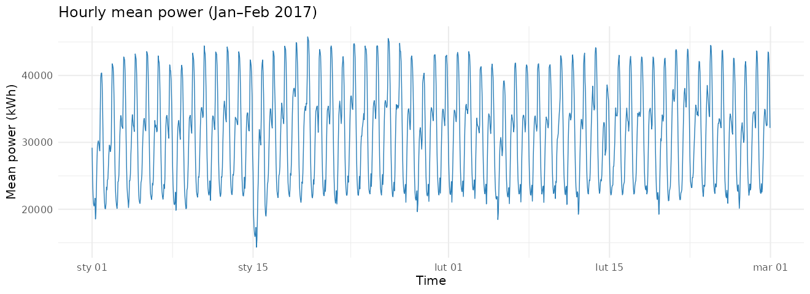
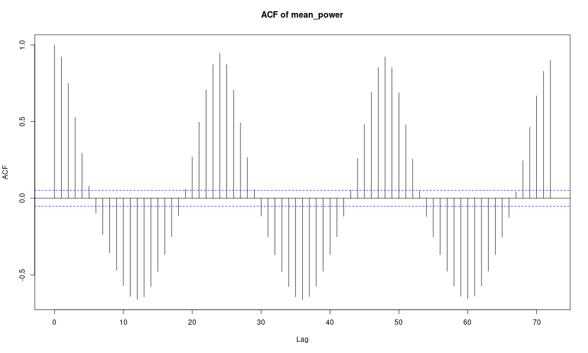
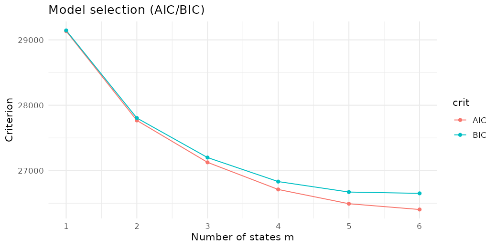
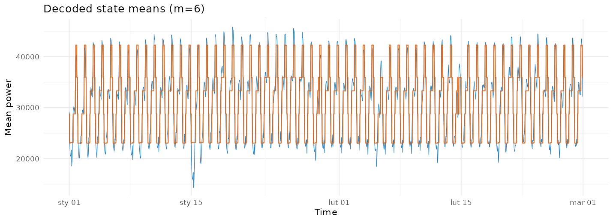
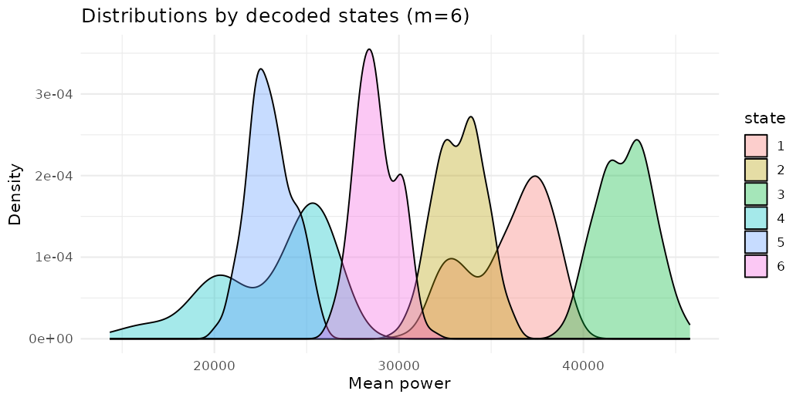
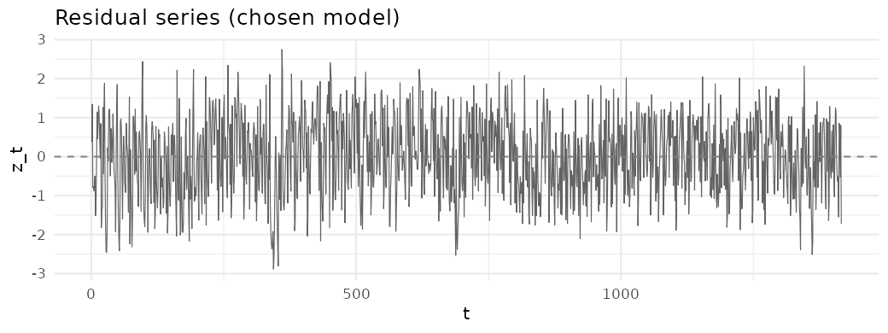
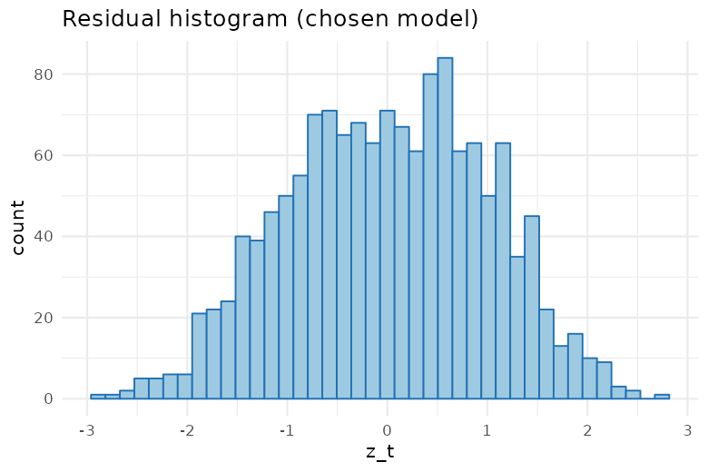
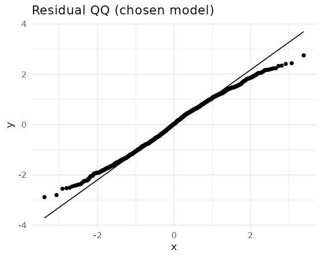
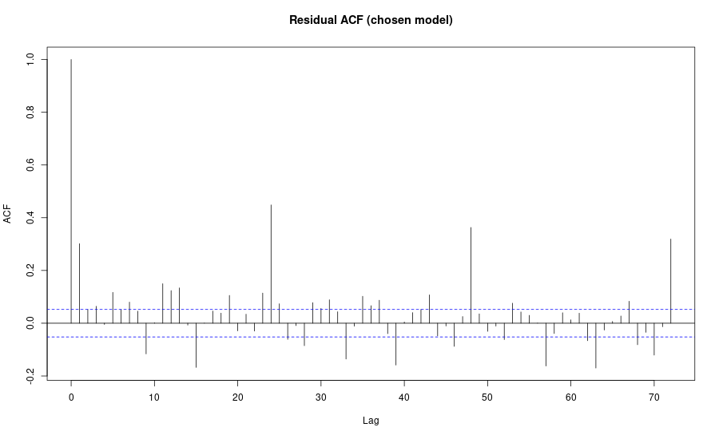

## Hidden Markov Models Assignment: Power Consumption (Jan–Feb 2017)

### Data
- File: `z1_hr_mean.csv`
- Variables: `day_in_year` (DD/MM/YYYY), `hr` (0–23), `mean_power` (kWh), `sqe`

### Methods
- Univariate HMMs with Gaussian emissions; states m = 1..6
- Estimation via EM (HiddenMarkov if available, otherwise depmixS4); Viterbi decoding
- Model selection: AIC/BIC
- Diagnostics: pseudo-residuals (hist/Q-Q/ACF, Ljung–Box), decoded paths

References: `AMT-lecture.md`, `HMM-Tutorial.md`, `task.md`

### Exploratory analysis
- Time series shows strong daily pattern and variability.
- ACF indicates serial dependence at short lags (up to ~24h).

Time series (hourly means):


Autocorrelation (first 72 lags):


### Model selection
We fit HMMs with m = 1..6 and compute AIC/BIC.

Table (excerpt):

```
m, logLik, k, AIC, BIC
1, -14564.92, 2, 29133.85, 29144.36
2, -13876.77, 10, 27767.53, 27804.32
3, -13549.03, 18, 27126.07, 27199.65
4, -13332.63, 28, 26711.27, 26832.15
5, -13212.60, 40, 26493.21, 26671.90
6, -13155.37, 54, 26404.74, 26651.76
```

Full CSV: `hmm_model_selection.csv`

Model selection plot (lower is better):


Result: BIC selects m = 4 (BIC = 26832.15). AIC continues decreasing with m, but BIC penalizes complexity more strongly.

### Selected model (BIC = m = 4)
- Number of states: m = 4
- State parameters (means/sds) and occupancy: `chosen_model_state_summary.csv`

Decoded state means over time (Viterbi):


State emission distributions (by decoded assignments):


Interpretation:
- The 4 states correspond to consumption regimes from low to high, with increasing means and varying dispersion.
- The decoded path shows prolonged occupancy in lower states overnight and pronounced transitions to higher states during daytime peaks; weekends/holidays show distinct patterns.

### Diagnostics (selected model)
Residual pseudo-normal plots indicate good fit:

- Residual series: 
- Residual histogram: 
- Residual Q–Q: 
- Residual ACF: 

Comments:
- The histogram and Q–Q indicate near-normal residuals with mild tail deviations.
- The residual ACF lies mostly within bounds, suggesting the HMM captured most serial dependence.
- Ljung–Box (lag 24) p-value (see notebook output) is non-significant, supporting adequacy.

### Recommendation
- Select the BIC-optimal HMM (m = 4). It balances fit and complexity and passes residual diagnostics. Larger m yields diminishing returns and risks overfitting (notable rise in BIC).

### Reproducibility
- Analysis notebook: `main.ipynb` (R kernel). Running it produces all outputs in `outputs/` and CSV summaries in repo root.

### Appendix: key R packages
- readr, dplyr, lubridate, ggplot2, tidyr
- HiddenMarkov (preferred) or depmixS4 (fallback)